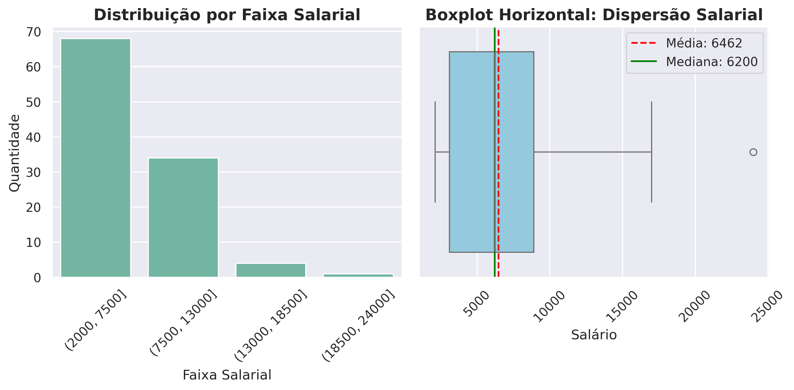
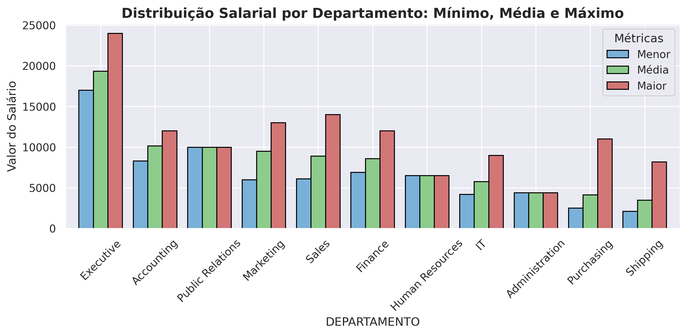
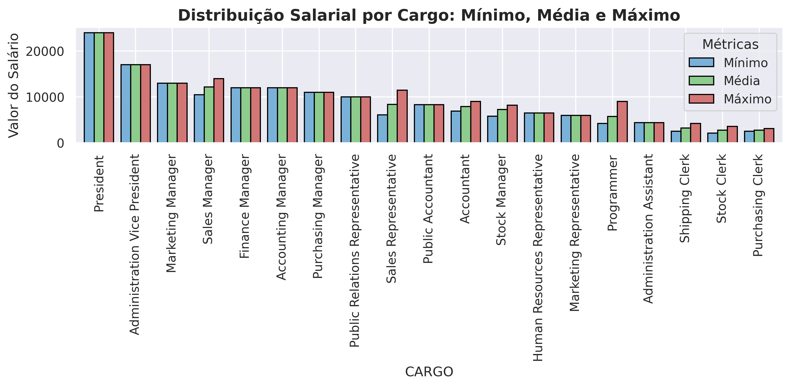
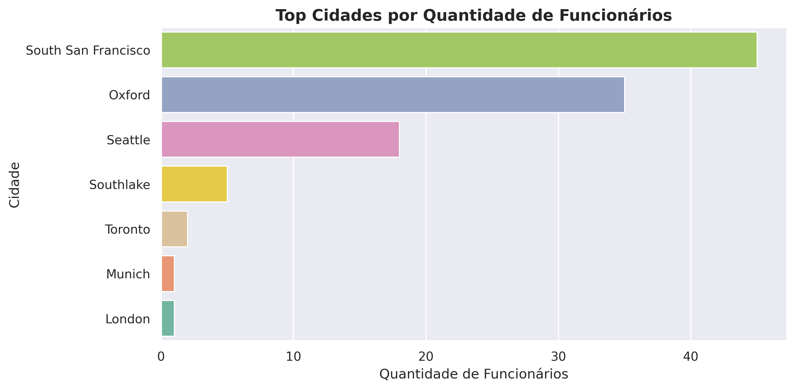
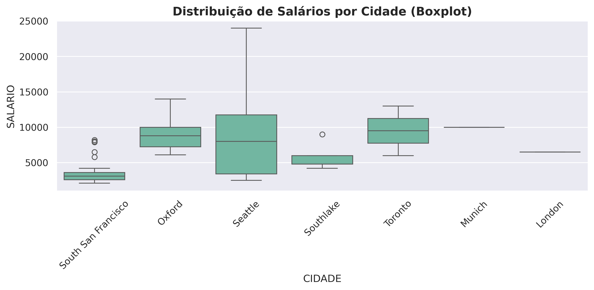

<br>
<br>

## 💻 Curso Datascience - Visualização de Dados e Business Intelligence. 

Projeto Avaliativo Final - Módulo 1 - Semana 13

Aluno: Luiz Felipe F V Vieira

<br>
<br>

## 🔍 AED (Análise Exploratória de Dados): "Base Recursos Humanos" 
Utilizando as tabelas do banco de dados 'HR' (Human Resources) da Oracle FreeSQL que contém registros sobre funcionários, cargos, departamentos, salários e distribuição geográfica.
(https://freesql.com/)

<br>

---

### 🎯 Propósito

> O objetivo é praticar SQL, Python e análise de dados de forma simples, como em uma rotina básica de trabalho. Após a AED devemos entender melhor a distribuição dos salários, a relação entre cargos e departamentos e os padrões de remuneração por região.
  
<br>

---

### 📦 Entregáveis

> O Projeto deverá ser entregue com os seguintes arquivos:

<br>

1. - [x] Código .sql (query_01.sql e query_02.sql) das duas consultas usadas no FreeSQL

2. - [x] Arquivos .csv (query_01.csv e query_02.csv) com os dados extratídos do FreeSQL

3. - [x] Arquivo .ipynb (projeto_aed_rh.ipynb) em Python (Jupyter Notebook) estruturado com as análises.

4. - [x] Arquivo README.md com a documentação completa do projeto.

5. - [ ] Versionamento com branch e commit no github.

6. - [ ] Vídeo explicativo demonstrando a visualização e utilização dos recursos desenvolvidos (enviar no AVA).


<br>

---

### ⚙️ Requisitos Funcionais (RF)

> O projeto deverá contemplar as seguintes etapas:

<br>

- [x] RF01: Conectar-se ao banco de dados FreeSQL (esquema HR)

- [x] RF02: Buscar dados das tabelas EMPLOYEES, DEPARTMENTS, JOBS, LOCATIONS, COUNTRIES e REGIONS

- [x] RF03: Desenvolver duas consultas SQL, utilizano pelo menos dois LEFT JOIN em cada consulta:

    ● Query 1: Salários por departamento e cargo;

    ● Query 2: Funcionários por região, incluindo informações de localização;

- [x] RF04: Aplicar um filtro utilizando um comando WHERE simples, por exemplo:

    ● WHERE SALARY > …

    ● WHERE DEPARTMENT_ID IS NOT NULL

    ● WHERE REGION_NAME IS NOT NULL

- [x] RF05: Exportar o resultado de cada consulta para arquivos CSV separados:

    ● query_01.csv

    ● query_02.csv

- [x] RF06: Importar os arquivos CSV no Python (Jupyter Notebook)

- [x] RF07: Realizar o fluxo ETL para investigação e limpeza nos dados.

- [x] RF08: Calcular medidas estatísticas básicas, como: média, mediana, valor mínimo, valor máximo

- [x] RF09: Realizar uma Análise Exploratória de Dados (EDA) simples

- [x] RF10: Criar pelo menos um gráfico, podendo ser: histograma ou boxplot

- [x] RF11: Documentar todo o desenvolvimento do projeto em um arquivo README.md

- [x] RF12: Publicar o projeto completo no GitHub e enviar o repositório da turma no AVA (incluindo o vídeo)

<br>

---

### 🧾 Sobre as Tabelas Usadas

<br>

> As seguintes tabelas do banco HR foram utilizadas no projeto. Os campos marcados foram selecionados para exportação e posterior AED com Python. A tabela principal (tabela fato) é a HR.EMPLOYEES.

<br>

| Tabela: **HR.EMPLOYEES** |
| :--- |
| |
| ✅ EMPLOYEE_ID |
| FIRST_NAME |
| LAST_NAME |
| EMAIL |
| PHONE_NUMBER |
| ✅ HIRE_DATE |
| JOB_ID |
| ✅ SALARY |
| ✅ COMMISSION_PCT |
| MANAGER_ID |
| DEPARTMENT_ID |

<br>

| Tabela: **HR.DEPARTMENTS** |
| :--- |
| |
| DEPARTMENT_ID |
| ✅ DEPARTMENT_NAME |
| MANAGER_ID |
| LOCATION_ID |

<br>

| Tabela: **HR.JOBS** |
| :--- |
| |
| JOB_ID |
| ✅ JOB_TITLE |
| ✅ MIN_SALARY |
| ✅ MAX_SALARY |

<br>

| Tabela: **HR.LOCATIONS** |
| :--- |
| |
| LOCATION_ID |
| STREET_ADDRESS |
| POSTAL_CODE |
| ✅ CITY |
| ✅ STATE_PROVINCE |
| COUNTRY_ID |

<br>

| Tabela: **HR.COUNTRIES** |
| :--- |
| |
| COUNTRY_ID |
| ✅ COUNTRY_NAME |
| REGION_ID |

<br>

| Tabela: **HR.REGIONS** |
| :--- |
| |
| REGION_ID |
| ✅ REGION_NAME |

<br>

> Primeiramente foi feita a verificação se existiam funcionários repetidos. Como a coluna EMPLOYEE_ID não tem linhas repetidas, a primeira verificação foi feita pelas colunas FIRST_NAME + LAST_NAME e depois foi verificado se existiam linhas repetidas na coluna EMAIL. 

<br>

**OBJETIVO DESTAS CONSULTAS**: Como a proposta é fazer somente análises abrangentes por departamento, cargo e distribuição geográfica, iremos exportar os dados de forma anônima (removendo os dados sensíveis como nome, sobrenome, email e telefone). Então a consulta de duplicatas se faz necessária ainda no banco de dados, pois após a remoção destas colunas, podem haver valores duplicados para funcionários distintos.

<br>

**RESULTADO**: Para ambas verificações, não foram encontrados valores duplicados. As consultas também foram salvas nos arquivos `query_duplicated_email.sql` e `query_duplicated_name.sql`.

<br>

**EXECUÇÃO DO SQL**:

Para a primeira verificação foi utilizado o seguinte código SQL abaixo. Este código seleciona as colunas FIRST_NAME e LAST_NAME e agrupa todas as linhas que têm a mesma combinaçao de nome e sobrenome.

Ao mesmo tempo armazena a quantidade de repetições em uma nova coluna chamada 'qtde' e exibe somente os resultados que possuem a contagem maior que 1 (HAVING COUNT(*) > 1).

```sql
SELECT 
    FIRST_NAME, 
    LAST_NAME, 
    COUNT(*) as qtde
FROM 
    HR.EMPLOYEES
GROUP BY 
    FIRST_NAME, 
    LAST_NAME
HAVING 
    COUNT(*) > 1; 
``` 

<br>

Para a segunda verificação foi utilizada a mesma lógica anterior, porém somente com a coluna EMAIL.

```sql
SELECT 
    EMAIL, 
    COUNT(*) as qtde
FROM 
    HR.EMPLOYEES
GROUP BY 
    EMAIL
HAVING 
    COUNT(*) > 1;   
```

<br>

---

### 🛢️ Código das consultas SQL

<br>

> Com objetivo de entender melhor a distribuição dos salários, a relação entre cargos e departamentos e os padrões de remuneração por região, foram feitas duas consultas SQL e exportados os resultados em arquivos .csv para ETL e AED no Python.

<br>

**OBSERVAÇÕES**: 

As colunas já foram renomeadas nas consultas para facilitar o entendimento na AED.

Foram utilizados "LEFT JOIN" para preservar a integridade da tabela fato "EMPLOYEES", pois garante que todos os registros estarão listados, mesmo aqueles que não tenham correspondência nas outras tabelas (dimensão).

As consultas foram salvas como `query_01.sql` e `query_02.sql` e os resultados foram salvos como `query_01.csv` e `query_02.csv` respectivamente.

<br>

**EXECUÇÃO DO SQL**:

A primeira query visa responder a relação de salários por departamento e cargos, para isso foram selecionadas as colunas id, data_contratacao, salario e comissao da tabela Employees, a coluna departamento da tabela Departments e as colunas cargo, cargo_salario_min e cargo_salario_max da tabela Jobs.

Como a análise posterior irá focar no cargo, foi verificado que todas as linhas possuiam o registro na coluna JOB_TITLE. No entanto, a cláusula "_WHERE J.JOB_TITLE IS NOT NULL_" foi mantida para tornar a consulta mais robusta e defensiva, garantindo que dados incompletos não distorçam os resultados da agregação.


```sql
SELECT
    E.EMPLOYEE_ID AS id,
    E.HIRE_DATE AS data_contratacao,
    E.SALARY AS salario,
    E.COMMISSION_PCT AS comissao,
    D.DEPARTMENT_NAME AS departamento,
    J.JOB_TITLE AS cargo,
    J.MIN_SALARY AS cargo_salario_min,
    J.MAX_SALARY AS cargo_salario_max
FROM HR.EMPLOYEES E
LEFT JOIN HR.DEPARTMENTS D
    ON E.DEPARTMENT_ID = D.DEPARTMENT_ID
LEFT JOIN HR.JOBS J
    ON E.JOB_ID = J.JOB_ID
WHERE J.JOB_TITLE IS NOT NULL     
ORDER BY E.EMPLOYEE_ID;
```

<br>

A segunda query visa analisar salários e distribuição geográfica, para isso foram selecionadas as colunas id, data_contratacao, salario e comissao da tabela Employees, a coluna departamento da tabela Departments, as colunas cidade e estado da tabela Locations, a coluna pais da tabela Countries e a coluna regiao da tabela Regions.

Já nessa consulta o filtro "_WHERE E.SALARY IS NOT NULL AND E.SALARY > 0_" garante a qualidade dos dados na análise. Ele exclui registros incompletos (NULL) e valores inválidos como zero ou negativos, evitando distorções nas métricas salariais.


```sql
SELECT
    E.EMPLOYEE_ID AS id,
    E.HIRE_DATE AS data_contratacao,
    E.SALARY AS salario,
    E.COMMISSION_PCT AS comissao,
    D.DEPARTMENT_NAME AS departamento,
    L.CITY AS cidade,
    L.STATE_PROVINCE AS estado,
    C.COUNTRY_NAME AS pais,
    R.REGION_NAME AS regiao
FROM HR.EMPLOYEES E
LEFT JOIN HR.DEPARTMENTS D
    ON E.DEPARTMENT_ID = D.DEPARTMENT_ID
LEFT JOIN HR.LOCATIONS L
    ON D.LOCATION_ID = L.LOCATION_ID
LEFT JOIN HR.COUNTRIES C
    ON L.COUNTRY_ID = C.COUNTRY_ID
LEFT JOIN HR.REGIONS R
    ON C.REGION_ID = R.REGION_ID
WHERE  E.SALARY IS NOT NULL
    AND E.SALARY > 0
ORDER BY R.REGION_NAME, C.COUNTRY_NAME, L.CITY;
```

<br>

---

### 🐍 Análises Feita em Python (Jupyter Notebook)

<br>

> Foi criado um Fluxo do Pipeline de Dados com as etapas de ETL (Extract - Transform - Load) e de EDA (Exploratory Data Analysis - AED)

<br>

**1. EXTRACT - Verificação e conhecimento da base**

Nesta etapa foram importadas as bibliotecas necessária para análise (pandas, matplotlib e seaborn) e os arquivos .csv gerados no FreeSQL (query_01.csv e query_02.csv). 

Após foram utilizados os médodos `.head()`, `.tail()`, `.info()`, `.isnull().sum()` e `.nunique()` do pandas para investigação das tabelas, colunas e dados, além da contagem de nulos e contagem de registros únicos em cada coluna.

<br>

**2. TRANSFORM - Limpeza dos dados (DUPLICADOS)**

A verificação de linhas duplicadas já foi feita diretamente na tabela fato do banco HR (FreeSQL). Então nessa etapa, apenas para fins didáticos, foram feitas as consultas de total de linhas, linhas únicas e linhas duplicadas para exemplificar o código em Python utilizado para este fim.

<br>

**3. TRANSFORM - Correção e tratamento dos dados**

Ainda na transformação dos dados, foi gerada uma cópia de cada DataFrame para iniciar as modificações necessárias. Desta forma preservamos os DataFrames carregados originalmente.

_3.1. Correção de data (str > datetime)_

Foi utilizado o método `to_datetime()` do pandas para transformar a coluna DATA_CONTRATACAO de string para o tipo datetime e futuramente a criação de novas features de data.

_3.2. Conversão e otimização dos tipos de dados_

Para realizar a adequação dos tipos de dados das colunas visando reduzir o consumo de memória e melhorar a eficiência das operações analíticas foram feitas conversão nos tipos de dados.

- Colunas categóricas -> Convertidas de str (string) para o tipo category

- Colunas numéricas -> Ajustado para tipo mais compacto de int64 para int16 e int32

_3.3. Inconsistência de dados_

Nesta etapa foi verificada a consistência dos dados nas colunas categoricas. Para isso foi utilizado o método `.value_counts(dropna=False)` em cada coluna categorica. Desta forma é possível verificar quais dados estão nessas colunas e quantas vezes aparece cada um. 

O objetivo é verificar algum dado que possa estar incorreto (que não representa aquela categoria) e utilizando o parâmetro `(dropna=False)` também conseguimos contar quantos `NaN` (ou vazios) existem em cada coluna.

- _CONCLUSÃO_: 

Na tabela de Cargos e Departamentos foi encontrado um registro com a coluna DEPARTAMENTO sem valor (ID=178). Este mesmo registro possuia a coluna CARGO com o valor 'Sales Representative'. Após investigação na tabela, foi constatado que todos os registros que possuiam o mesmo cargo estavam no Departamento 'Sales'. Portanto, podemos determinar que este funcionário com o referido cargo, também pertence ao mesmo departamento e assim foi atribuído.

Na tabela de Localização foram encontrados 2 registros inconsistêntes. 

O primeiro (ID=203) tinha apenas a coluna ESTADO vazia. Após a verificação do País a qual pertencia e das Cidades que pertenciam ao mesmo País, foi constatado que existiam apenas as Cidades Oxford (com 34 registros) pertencente ao Estado de Oxford e a Cidade de London (com 1 registro) e que estava sem o Estado. Para não haver inconsistência nas análises, foi atribuído o estado de London (mesmo nome da cidade), seguindo o padrão da outra cidade.

Já o segundo registro (ID=178) é o mesmo funcionário que foi encontrada a inconstância na coluna DEPARTAMENTO. Como na exportação dos dados do FreeSQL utilizamos LEFT JOIN e a tabela HR.LOCATIONS tem relação direta com a tabela HR.DEPARTMENTS, todos os dados de localização vieram vazios pela falta do departamento. Como na análise anterior já descobrimos que este registro pertence ao departamento 'Sales', pesquisamos todos os registros do mesmo departamento para descobrir em qual localidade se encontravam. Todos os 34 registros estavam na mesma localidade, então foi concluído que este registro também pertence a mesma localidade e assim foram preenchidos os campos.

_3.4. Engenharia de Features_

Foram criadas 3 novas features (colunas) temporais (DIA, MES, ANO) através da coluna DATA_CONTRATACAO utilizando os métodos `.dt.day`, `dt.month` e `dt.year`. Também foi criada 1 nova feature numérica (TEMPO_CASA) subtraindo a data atual da data de contratação e dividido por 365.25 para o resultado ser em anos. Desta forma é possível fazer análises por período de tempo.

<br>

**4. LOAD - Gerar nova base limpa**

Completando o fluxo de ETL foi gerada uma nova base final como fonte única da verdade. Como as duas tabelas vieram da mesma tabela fato HR.EMPLOYEES, elas foram mescladas e transformadas em uma única base limpa. Toda a AED será feita nessa tabela única. Para garantir a persistência dos dados finais, esta nova tabela foi salva como um novo arquivo `base_final.csv`.

<br>

---

### 📊 Visualizações e Resultados

<br>

> Para AED foram feitas 6 análises sendo gerados os gráficos e insights sobre cada uma delas


<br>

**5. AED - Gerar estatísticas e análises**

<br>

**- 5.1 -> Estatísticas para coluna SALÁRIO** (média; mediana; desvio padrão; moda; máximo; mínimo;contagem)

Foram utilizados os métodos `.describe()` e `.mode().iloc[0]` para retornar dados estatísticos dos salários, bem como criadas faixas (bins) para medir a distribuição.

<br>

**CONCLUSÕES**: 

- Mediana (50% - 6200.00): Indica que 50% dos funcionários recebem até esse valor.

- Média (mean = 6461.83): A média é ligeiramente maior que a mediana o que mostra uma assimetria a direita, onde poucos salários muito altos (como o outlier máx em 24000) puxam a média para cima enquano que a maioria das pessoas (68) estão concentradas na faixa inferior ( < 7500).

- Desvio Padrão (std = 3909.58): O desvio padrão é alto onde confirma a grande dispersão da amostra.

- Mínimo e Máximo: O menor salário é 2100 e o maior 24000 o que evidencia uma faixa salarial ampla.

- Moda: O valor de salário mais frequente é de 2500 e isso corrobora com nossa classe modal (faixa com mais ocorrências) que ficou no bin de 2000 - 7500.

<br>

**GRÁFICO**: 



<br>

**- 5.2 -> Salários por departamento e cargo**

Os dados foram agrupados por departamentos e depois por cargos e calculadas 3 métricas para cada departamento: mínimo, média e máximo.

<br>

**CONCLUSÕES POR DEPARTAMENTO**: 

- O gráfico foi ordenado pela média salarial de cada departamento. Observa-se que o departamento "Executive" apresenta a maior média salarial, enquanto "Shipping" possui a menor.

- Em alguns departamentos, os salários mínimo e máximo estão relativamente próximos da média, indicando menor dispersão salarial. Já em departamentos como Shipping, Purchasing e Sales, a diferença entre os salários mínimo e máximo é maior, evidenciando maior variabilidade salarial dentro dessas áreas.

<br>

**GRÁFICO**: 



<br>

**CONCLUSÕES POR CARGOS**: 

- O gráfico foi ordenado pela média salarial dos cargos. Observa-se que President possui a maior média salarial, seguido por Administration Vice President, enquanto Purchansing Clerk apresenta a menor média salarial.

- Alguns cargos, como President, Accounting Manager, Finance Manager e Marketing Manager, apresentam salários mínimo, médio e máximo praticamente iguais, indicando uma remuneração padronizada para esses cargos ou a existência de apenas 1 funcionário neste cargo.

- Em contrapartida, cargos como Sales Manager, Sales Representative, Programmer e Accountant apresentam maior diferença entre os salários mínimo e máximo, evidenciando maior variabilidade salarial entre os ocupantes desses cargos.

<br>

**GRÁFICO**: 



<br>

**- 5.3 -> Funcionários por região (CIDADE)**

Os dados foram agrupados por CIDADE e contados a quantidade de funcionários pelo ID.

<br>

**CONCLUSÕES**: 

- A maioria dos funcionários estão na localidade de "South San Francisco" (California) com 45 funcionários, seguido por "Oxford" (Oxford) com 35 funcionarios e "Seattle" (Washington) com 18 funcionários.

- Interessante notar que as cidades de "Munich" (Bavaria) e "London" (London) possuem apenas 1 funcionário cada

<br>

**GRÁFICO**: 



<br>

**- 5.4 -> Salários por região (CIDADE)**

Para obserar a distribuição de salários por cidades, foi utilizado o gráfico de bloxpot com eixo x sendo as Cidades e o eixo y sendo o Salários.


<br>

**CONCLUSÕES**: 

- Seattle apresenta a maior dispersão salarial, com salários variando aproximadamente entre R$ 2.500 e R$ 24.000.

- Toronto e Oxford possuem medianas salariais relativamente elevadas e menor dispersão que Seattle, sugerindo salários mais concentrados em torno da mediana.

- South San Francisco concentra os menores salários da amostra, embora apresente alguns outliers com remunerações significativamente superiores ao restante dos funcionários da cidade.

- Munich e London como possuem somente 1 funcionário faz com que não haja dispersão salarial.

<br>

**GRÁFICO**: 



<br>

**- 5.5 -> Ano / Mês com maiores contratações**

Utilizando as novas features criadas, os dados foram agrupados por ANO e MES e calculado o tamanho (quantidade) de índices em cada agrupamento.


<br>

**CONCLUSÕES**: 

- Observa-se uma tendência de crescimento nas contratações entre 2011 e 2015, ano em que foi registrado o maior número de admissões. A partir de 2016, houve uma redução gradual no número de contratações, embora os valores permaneçam superiores aos observados no início da série.

- Em relação à sazonalidade, março foi o mês com maior número de contratações, enquanto setembro e novembro apresentaram os menores volumes. As contratações ocorreram ao longo de todo o ano, porém com maior concentração no primeiro trimestre, especialmente entre janeiro e março.

<br>

**GRÁFICO**: 

![grafico_06(./images/06_sazonalidade_contratacao.png)

<br>

**- 5.6 -> Tempo de casa vs Salário para um mesmo Departamento**

Com a nova feature (TEMPO_CASA) foi utilizado um gráfico de dispersão (scatterplot) para relacionar o salário vs tempo de casa e colorido (hue) pelo departamento. No mesmo gráfico foi utilizado uma linha de tendência (regplot - linha regressão linear), para visualizar a tendência geral entre salários e tempo de casa.

<br>

**CONCLUSÕES**: 

- A linha de regressão preta indica uma correlação linear positiva, ou seja, na média da empresa, quanto maior o tempo de casa, maior tende a ser o salário do funcionário.

- Embora a tendência geral seja de alta alguns departamentos tem comportamentos diferentes. 

Exemplos: 

Executive, apresenta os salários mais isolados e elevados do gráficos (outliers acima de 15000) mesmo sem tem o maior tempo de casa. Ainda podemos observar um funcionário com aproximadamente 13 anos de casa ganhando mais que outro com mais de 15 anos.

Sales e Finance, apresentam uma progressão salarial acima da média conforme o tempo passa.

Shipping e Purchasing, ficam concentrados na base do gráfico (abaixo de 5000), mostrando pouca variação salarial relevante com o aumento do tempo de casa.

- Dispersão e variabilidade: A área sombreada (intervalo de confiança) alarga-se nos anos finais (após 13 anos). Issso mostra que, para funcionários muito antigos, o salário se torna menos previsível apenas pelo tempo de casa, dependendo mais de fatores como o departamento em que ele trabalha.

<br>

**GRÁFICO**: 

![grafico_07(./images/07_tempocasa_salario.png)

<br>


---

### 🚀 Como Executar o Projeto (Instalação)

> #### Pré-requisitos
<br>

* **Python:** Versão 3.12.3 ou superior.
* **Ambiente virtual .venv:** Criação do ambinte virtual e instalação das dependências.

<br>

> #### Instalação e Configuração

<br>

1. **Clone o repositório e acesse a pasta:**

```bash
git clone https://github.com/lf-vampre/sctec-datascience-projeto-avaliativo-1
cd sctec-datascience-projeto-avaliativo-1
```

<br>

2. **Crie e ative o ambiente virtual (venv):**
```bash

python3 -m venv .venv # ou então: python -m venv .venv

```

* Ativação (Linux/WSL/MacOS):
```bash

source .venv/bin/activate

```

* Ativação (Windows - PowerShell):
```bash

.\.venv\Scripts\Activate.ps1

```

<br>

3. **Instale as dependências:**
```bash

pip install -r requirements.txt

```

<br>

### 💻 Uso Básico

> Abra o arquivo "projeto_aed_rh.ipynb" no vscode, selecione o kernel do python do ambiente .venv e rode todas as células ou uma a uma para acompanhar o pipeline de dados

<br>

---

### 💡 Sugestões de melhoria para futuras versões

<br>

- Para uma versão futura desta AED poderíamos cruzar mais dados gerando novos insights, bem como gerar outros tipos de gráficos. Por exemplo, criar um Heatmap da média salarial por Departamento x Cargo ou um Heatmap de Salários por tempo de casa.

- Poderiam ser respondidas novas perguntas sobre o negócio como por exemplo:

Qual departamento tem o maior número de funcionários?

Qual é o impacto da folha de pagamento por departamento, cargo, ou região? (somando-se os salários)

Existe predominância de determinados cargos em algumas cidades?

- Para uma melhor apresentação, poderia ser criado um Dashboard resumindo os principais indicadores e insights e ainda torná-lo interativo com seleção de opções categóricas ou de tempo.

<br>

---

### 🛠️ Tecnologias Utilizadas

* **Linguagem:** Python (Pandas, Matplotlib, Seaborn), SQL.
* **Base de Dados:** csv.
* **Ambiente:** VS Code / WSL / venv
* **Orquestração:** Lógica celular em Jupyter Notebook.


<br>

---

### 📜 Histórico de Commits (git log --oneline)

<br>
